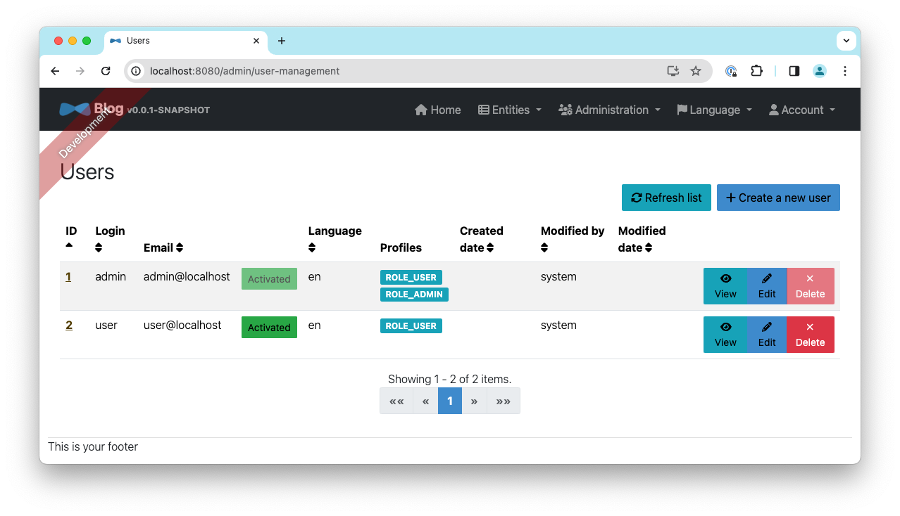
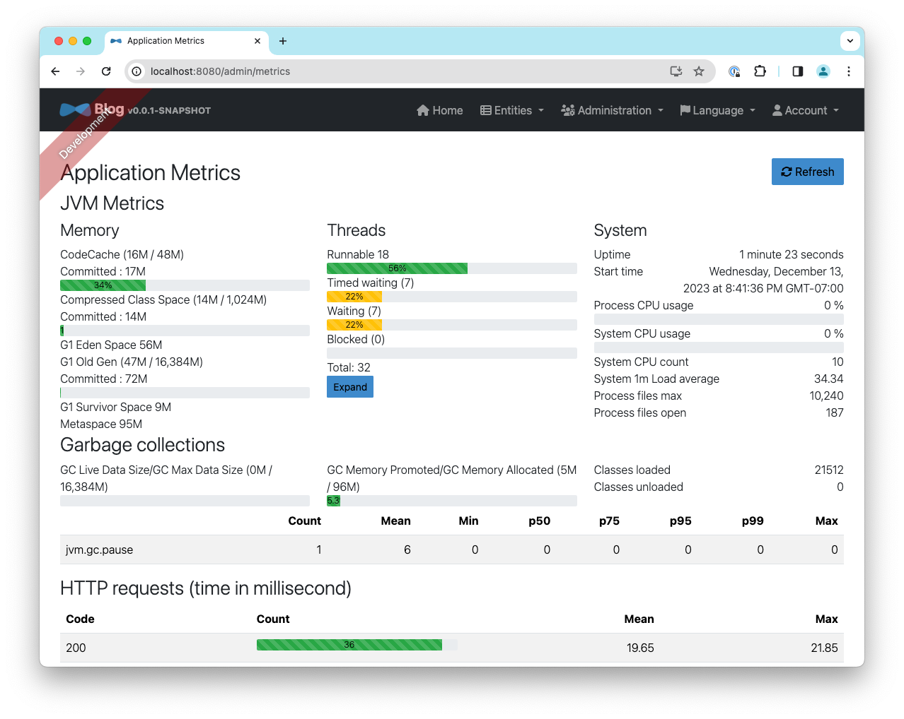
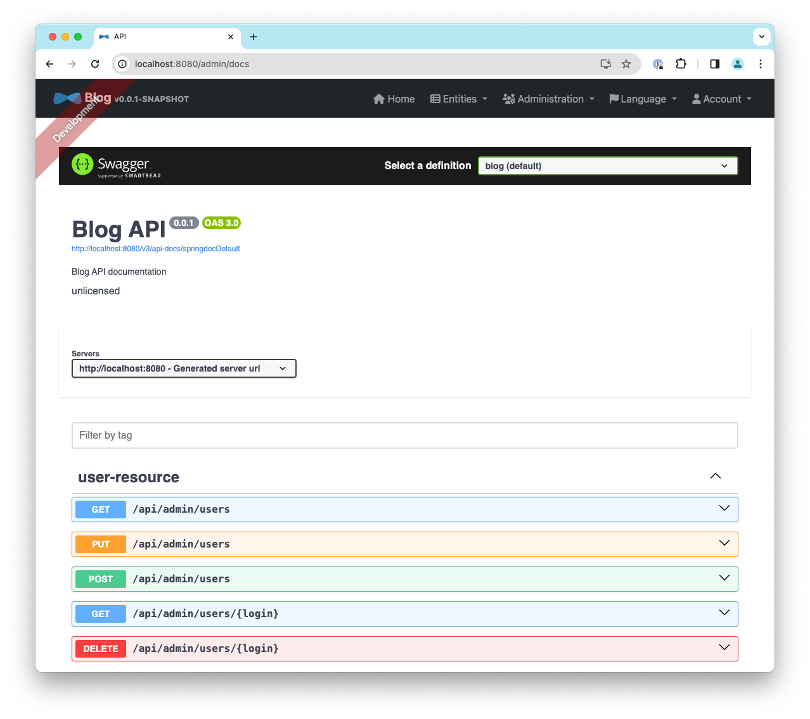
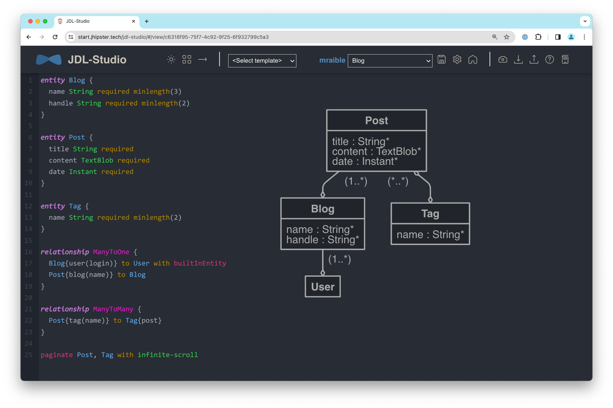

= Get Started with JHipster 8
:author: Matt Raible
:email:  matt@raibledesigns.com
:revnumber: 1.2
:revdate: {docdate}
:subject: JHipster
:keywords: JHipster, Spring Boot, Angular, JWT, Authorization, Heroku
:icons: font
:lang: en
:language: javadocript
:sourcedir: .
ifndef::env-github[]
:icons: font
endif::[]
ifdef::env-github,env-browser[]
:toc: preamble
:toclevels: 2
endif::[]
ifdef::env-github[]
:status:
:outfilesuffix: .adoc
:!toc-title:
:caution-caption: :fire:
:important-caption: :exclamation:
:note-caption: :paperclip:
:tip-caption: :bulb:
:warning-caption: :warning:
endif::[]
:toc:

This article shows you how to build a simple blog application with https://www.jhipster.tech/2024/04/08/jhipster-release-8.3.0.html[JHipster 8.3.0]. You can also https://www.youtube.com/watch?v=IfyjKCt6YHE[watch a screencast of this tutorial on YouTube].

ifdef::env-github[]
TIP: It appears you're reading this document on GitHub. If you want a prettier view, install https://chrome.google.com/webstore/detail/asciidoctorjs-live-previe/iaalpfgpbocpdfblpnhhgllgbdbchmia[Asciidoctor.js Live Preview for Chrome], then view the https://raw.githubusercontent.com/mraible/jhipster8-demo/main/README.adoc?toc=left[raw document]. Another option is to use the https://gist.asciidoctor.org/?github-mraible%2Fjhipster8-demo%2Fmain%2F%2FREADME.adoc[DocGist view].
endif::[]

.Source Code
****
If you'd like to get right to it, the https://github.com/mraible/jhipster8-demo[source code for this application is on GitHub]. To run the app, use `./mvnw`. To test it, run `./mvnw verify`. To run its end-to-end tests, run `./mvnw` in one terminal and `npm run e2e` in another.
****

== What is JHipster?

JHipster is one of those open-source projects you stumble upon and immediately think, "`Of course!`" It combines three very successful frameworks in web development: Bootstrap, Angular, and Spring Boot. Bootstrap was one of the first dominant web-component frameworks. Its most substantial appeal was that it only required a bit of HTML, and it worked! All the efforts we made in the Java community to develop web components were shown a better path by Bootstrap. It leveled the playing field in HTML/CSS development, much like Apple's Human Interface Guidelines did for iOS apps.

https://www.julien-dubois.com/[Julien Dubois] started JHipster in October 2013 (Julien's first commit was on https://github.com/jhipster/generator-jhipster/commit/c8630ab7af7b6a99db880b3b0e2403806b7d2436[October 21, 2013]). The first public release (version 0.3.1) launched on December 7, 2013. Since then, the project has had 250 releases! It is an open-source, Apache 2.0-licensed project on GitHub. It has a core team of 30 developers and over 700 contributors. You can find its homepage at https://www.jhipster.tech/[www.jhipster.tech]. If you look at https://github.com/jhipster/generator-jhipster[the project on GitHub], you can see it's mostly written in TypeScript (57%), Java (18%), and JavaScript (13%).

JHipster 8 is the same JHipster many developers know and love, with a couple of bright and shiny new features: namely Spring Boot 3.2, Angular 17, Vue 3, and Java 21 support.

== Install JHipster 8

The http://www.jhipster.tech/installation/[Installing JHipster] instructions show you all the tools you'll need to use a released version of JHipster.

. Install Java 17 https://sdkman.io/[using SDKMAN!]
. Install Git from https://git-scm.com.
. Install Node.js from http://nodejs.org. JHipster recommends using Node 20.
. Run the following command to install JHipster.

    npm i -g generator-jhipster@8

== Create a Project

To create a project, open a terminal window and create a directory. For example, `mkdir blog`. Navigate into the directory and run `jhipster`. You'll be prompted to answer several questions about the type of application you want to create and what features you'd like to include. The screenshot below shows the choices I made to create a simple blog application with Angular.

.Generating the application


If you'd like to create the same application I did, you can place the following `.yo-rc.json` file in an empty directory and run `jhipster` in it. You won't be prompted to answer any questions because this file provides the answers.

[source,json]
----
{
  "generator-jhipster": {
    "applicationType": "monolith",
    "authenticationType": "jwt",
    "baseName": "blog",
    "buildTool": "maven",
    "cacheProvider": "ehcache",
    "clientFramework": "angular",
    "clientTestFrameworks": ["cypress"],
    "clientTheme": "none",
    "creationTimestamp": 1702525034689,
    "cypressAudit": true,
    "cypressCoverage": true,
    "databaseType": "sql",
    "devDatabaseType": "h2Disk",
    "devServerPort": 4200,
    "enableGradleEnterprise": null,
    "enableHibernateCache": true,
    "enableSwaggerCodegen": false,
    "enableTranslation": true,
    "entities": ["Blog", "Post", "Tag"],
    "feignClient": false,
    "gradleEnterpriseHost": null,
    "jhipsterVersion": "8.3.0",
    "jwtSecretKey": "YjFjNDdlM2FhMzBlYmMwZTJjNjAxNjg2OWZhOTY1M2Y1YTdlYzk3ZjFiYTBkMmUwODEyMGJiMjYxMGU5Zjg4MDM5ZDhiODkxNjc2NDc0NDMwMzU4NGIxMDBlMGM1MWEyNjAwM2ZjYTRjNmE2ZjM1OTZkN2I5NTU3Yzk0MjU2MTk=",
    "languages": ["en", "es"],
    "lastLiquibaseTimestamp": 1702525214000,
    "messageBroker": false,
    "microfrontend": null,
    "microfrontends": [],
    "nativeLanguage": "en",
    "packageName": "org.jhipster.blog",
    "prodDatabaseType": "postgresql",
    "reactive": false,
    "searchEngine": false,
    "serverPort": null,
    "serverSideOptions": [],
    "serviceDiscoveryType": false,
    "testFrameworks": ["cypress"],
    "websocket": false,
    "withAdminUi": true
  }
}
----

The project creation process will take a couple of minutes to run, depending on your internet connection speed. When it's finished, you should see output like the following.

.Generation success


Run `./mvnw` to start the application and navigate to http://localhost:8080 in your favorite browser. The first thing you'll notice is a hipster explaining how you can sign in or register.

.Default homepage


Sign in with username `admin` and password `admin`, and you'll have access to navigate through the **Administration** section. This section offers nice-looking UIs on top of some Spring Boot's many monitoring and configuration features. It also allows you to administer users:

.User management


**Administration** > **Metrics** gives you insights into Application and JVM metrics:

.Application metrics


**Administration** > **API** allows you to see the Swagger docs associated with its API.

.Swagger docs


You can run the following command (in a separate terminal window) to run the Cypress tests and confirm everything is working correctly.

----
npm run e2e
----

== Generate Entities

For each entity you want to create, you will need:

* a database table;
* a Liquibase changeset;
* a JPA entity class;
* a Spring Data `JpaRepository` interface;
* a Spring MVC `RestController` class;
* an Angular list component, edit component, service; and
* several HTML pages for each component.

Also, you should have integration tests to verify that everything works and performance tests to confirm that it runs fast. In an ideal world, you'd also have unit tests and integration tests for your Angular code.

The good news is JHipster can generate all of this code for you, including integration tests and performance tests. If you have entities with relationships, it will create the necessary schema to support them (with foreign keys), and the TypeScript and HTML code to manage them. You can also set up validation to require certain fields as well as control their length.

JHipster supports several methods of code generation. The first uses its https://www.jhipster.tech/creating-an-entity/[entity sub-generator]. The entity sub-generator is a command-line tool that prompts you with questions that you answer.

https://start.jhipster.tech/jdl-studio/[JDL-Studio] is a browser-based tool for defining your domain model with JHipster Domain Language (JDL). I like the visual nature of JDL-Studio, so I'll use it for this project.

TIP: A fantastic alternative to JDL Studio is the https://plugins.jetbrains.com/plugin/19697-jhipster-jdl[JHipster JDL Plugin for IntelliJ IDEA]. https://twitter.com/Yuriy_Artamonov[Yuriy Artamonov] created and maintains this plugin. It's a great way to visualize your JDL and generate entities.

Below is the entity diagram and JDL code needed to generate a simple blog with blogs, posts, and tags.

.Blog entity diagram


TIP: You can find a few other https://github.com/jhipster/jdl-samples[JDL samples on GitHub].

If you'd like to follow along, copy/paste the contents of the JDL below into a `blog.jdl` file.

.blog.jdl
----
entity Blog {
  name String required minlength(3)
  handle String required minlength(2)
}

entity Post {
  title String required
  content TextBlob required
  date Instant required
}

entity Tag {
  name String required minlength(2)
}

relationship ManyToOne {
  Blog{user(login)} to User with builtInEntity
  Post{blog(name)} to Blog
}

relationship ManyToMany {
  Post{tag(name)} to Tag{post}
}

paginate Post, Tag with infinite-scroll
----

Run the following command to import this file and generate entities, tests, and a UI.

[source,shell]
----
jhipster jdl blog.jdl
----

You'll be prompted to overwrite `src/main/webapp/i18n/en/global.json`. Type **a** to overwrite this file, as well as others.

Restart the application with `/.mvnw`.

You might notice that each entities' list screen is pre-loaded with data. https://github.com/marak/Faker.js/[faker.js] creates this data. To turn it off, edit `src/main/resources/config/application-dev.yml`, search for `faker` and remove it from the `liquibase.contexts` configuration. I made this change in this example's code.

[source,yaml]
----
liquibase:
 # Add 'faker' if you want the sample data to be loaded automatically
 contexts: dev
----

TIP: If you still have data in your list screens after making this change, run `./mvnw clean` to delete the H2 database.

Create a couple of blogs for the existing `admin` and `user` users and a few blog entries.

.Blogs


.Entries


From these screenshots, you can see that users can see each other's data and modify it.

== Add Business Logic

TIP: To configure an IDE with your JHipster project, see https://www.jhipster.tech/configuring-ide/[Configuring your IDE]. Instructions exist for Eclipse, IntelliJ IDEA, Visual Studio Code, and NetBeans.

To add more security around blogs and entries, open `BlogResource.java` and find the `getAllBlogs()` method. Change the following line:

[source,java]
.src/main/java/org/jhipster/blog/web/rest/BlogResource.java
----
return blogRepository.findAll();
----

To:

[source,java]
----
return blogRepository.findByUserIsCurrentUser();
----

The `findByUserIsCurrentUser()` method is generated by JHipster in the `BlogRepository` class and allows limiting results by the current user. In `BlogRepository`, add a where clause to the `findAllWithToOneRelationships()` method to limit results by the current user.

[source,java]
.src/main/java/org/jhipster/blog/repository/BlogRepository.java
----
public interface BlogRepository extends JpaRepository<Blog, Long> {
    @Query("select blog from Blog blog where blog.user.login = ?#{authentication.name}")
    List<Blog> findByUserIsCurrentUser();

    // Find all eagerly and limit by current user
    @Query("select blog from Blog blog left join fetch blog.user where blog.user.login = ?#{authentication.name}")
    List<Blog> findAllWithToOneRelationships();
}
----

After making this change, re-compiling `BlogRepository` should trigger a restart of the application thanks to https://docs.spring.io/spring-boot/docs/current/reference/html/using-spring-boot.html#using-boot-devtools[Spring Boot's Developer tools]. If you navigate to http://localhost:8080/blog, you should only see the blog for the current user.

.Admin's blog


To add this same logic for entries, open `PostResource.java` and find the `getAllPosts()` method. Change the following line:

[source,java]
.src/main/java/org/jhipster/blog/web/rest/PostResource.java
----
page = postRepository.findAll(pageable);
----

To:

[source,java]
----
page = postRepository.findByBlogUserLoginOrderByDateDesc(
    SecurityUtils.getCurrentUserLogin().orElse(null), pageable);
----

Using your IDE, create this method in the `PostRepository` class. It should look as follows:

[source,java]
.src/main/java/org/jhipster/blog/repository/PostRepository.java
----
Page<Post> findByBlogUserLoginOrderByDateDesc(String username, Pageable pageable);
----

While you're in there, add a where clause to the `findAllWithToOneRelationships()` method to limit results by the current user.

[source,java]
.src/main/java/org/jhipster/blog/repository/PostRepository.java
----
@Query(value = "select post from Post post left join fetch post.blog where post.blog.user.login = ?#{authentication.name}", countQuery = "select count(post) from Post post")
Page<Post> findAllWithToOneRelationships(Pageable pageable);
----

Recompile both changed classes and verify that the `user` user only sees the posts you created for them.

.User's entries


Run `npm run e2e` in a new terminal window to confirm everything works as expected.

You might notice that this application doesn't look like a blog, and it doesn't allow HTML in the content field.

== Make UI Enhancements

When doing UI development on a JHipster-generated application, it's nice to see your changes as soon as you save a file. JHipster uses https://www.browsersync.io/[Browsersync] and https://webpack.github.io/[webpack] to power this feature. You enable this feature by running the following command in the `blog` directory.

----
npm start
----

In this section, you'll change the following:

. Change the rendered content field to display HTML
. Change the list of entries to look like a blog

=== Allow HTML

If you enter HTML in the `content` field of a blog post, you'll notice it's escaped on the list screen.

.Escaped HTML


To change this behavior, open `post.component.html` and change the following line:

[source,html]
.src/main/webapp/app/entities/post/list/post.component.html
----
<td>{{ post.content }}</td>
----

To:

[source,html]
----
<td [innerHTML]="post.content"></td>
----

After making this change, you'll see that the HTML is no longer escaped.

.HTML in entries


=== Improve the layout

To make the list of entries look like a blog, replace the `@if (posts && posts.length)` block with the following code that uses a stacked layout in a single column.

[source,html]
.src/main/webapp/app/entities/post/list/post.component.html
----
@if (posts && posts.length) {
<div class="table-responsive table-entities" id="entities">
  <div infinite-scroll
       (scrolled)="loadPage(page + 1)"
       [infiniteScrollDisabled]="page - 1 >= links['last']"
       [infiniteScrollDistance]="0">
    @for (post of posts; track trackId) {
    <div data-cy="entityTable">
      <a [routerLink]="['/post', post.id, 'view']" data-cy="entityDetailsButton">
        <h2>{{ post.title }}</h2>
      </a>
      <small>Posted on {{ post.date | formatMediumDatetime }}
        @if (post.blog) {
        <span>in <a [routerLink]="['/blog', post.blog.id, 'view']">{{ post.blog.name }}</a></span>
        }
      </small>
      <div [innerHTML]="post.content"></div>
      <div class="btn-group mb-2 mt-1">
        <button type="submit" [routerLink]="['/post', post.id, 'edit']" class="btn btn-primary btn-sm">
          <fa-icon icon="pencil-alt"></fa-icon>
          <span class="d-none d-md-inline" jhiTranslate="entity.action.edit" data-cy="entityEditButton">Edit</span>
        </button>
        <button type="submit" (click)="delete(post)" class="btn btn-danger btn-sm" data-cy="entityDeleteButton">
          <fa-icon icon="times"></fa-icon>
          <span class="d-none d-md-inline" jhiTranslate="entity.action.delete">Delete</span>
        </button>
      </div>
    </div>
    }
  </div>
</div>
}
----

Now it looks more like a regular blog!

.Blog entries


=== Lock It Down!

You can further enhance the security of your API by only allowing users that own a blog (or post) to edit it. Here's some pseudocode to show the logic:

[source,java]
----
Optional<Blog> blog = blogRepository.findById(id);
if (<blog.user does not match current user>) {
    throw new ResponseStatusException(HttpStatus.FORBIDDEN);
}
return ResponseUtil.wrapOrNotFound(blog);
----

Below is the patched `BlogResource.java` with additional logic in each method to prevent data tampering.

[source,patch]
----
Index: src/main/java/org/jhipster/blog/web/rest/BlogResource.java
IDEA additional info:
Subsystem: com.intellij.openapi.diff.impl.patch.CharsetEP
<+>UTF-8
===================================================================
diff --git a/src/main/java/org/jhipster/blog/web/rest/BlogResource.java b/src/main/java/org/jhipster/blog/web/rest/BlogResource.java
--- a/src/main/java/org/jhipster/blog/web/rest/BlogResource.java	(revision cec781478967455ce85659b5e188005fdfb0df91)
+++ b/src/main/java/org/jhipster/blog/web/rest/BlogResource.java	(date 1702532770536)
@@ -9,13 +9,16 @@
 import java.util.Optional;
 import org.jhipster.blog.domain.Blog;
 import org.jhipster.blog.repository.BlogRepository;
+import org.jhipster.blog.security.SecurityUtils;
 import org.jhipster.blog.web.rest.errors.BadRequestAlertException;
 import org.slf4j.Logger;
 import org.slf4j.LoggerFactory;
 import org.springframework.beans.factory.annotation.Value;
+import org.springframework.http.HttpStatus;
 import org.springframework.http.ResponseEntity;
 import org.springframework.transaction.annotation.Transactional;
 import org.springframework.web.bind.annotation.*;
+import org.springframework.web.server.ResponseStatusException;
 import tech.jhipster.web.util.HeaderUtil;
 import tech.jhipster.web.util.ResponseUtil;

@@ -53,6 +56,9 @@
         if (blog.getId() != null) {
             throw new BadRequestAlertException("A new blog cannot already have an ID", ENTITY_NAME, "idexists");
         }
+        if (!blog.getUser().getLogin().equals(SecurityUtils.getCurrentUserLogin().orElse(""))) {
+            throw new ResponseStatusException(HttpStatus.FORBIDDEN);
+        }
         Blog result = blogRepository.save(blog);
         return ResponseEntity
             .created(new URI("/api/blogs/" + result.getId()))
@@ -80,10 +86,12 @@
         if (!Objects.equals(id, blog.getId())) {
             throw new BadRequestAlertException("Invalid ID", ENTITY_NAME, "idinvalid");
         }
-
         if (!blogRepository.existsById(id)) {
             throw new BadRequestAlertException("Entity not found", ENTITY_NAME, "idnotfound");
         }
+        if (blog.getUser() != null && !blog.getUser().getLogin().equals(SecurityUtils.getCurrentUserLogin().orElse(""))) {
+            throw new ResponseStatusException(HttpStatus.FORBIDDEN);
+        }

         Blog result = blogRepository.save(blog);
         return ResponseEntity
@@ -115,10 +123,12 @@
         if (!Objects.equals(id, blog.getId())) {
             throw new BadRequestAlertException("Invalid ID", ENTITY_NAME, "idinvalid");
         }
-
         if (!blogRepository.existsById(id)) {
             throw new BadRequestAlertException("Entity not found", ENTITY_NAME, "idnotfound");
         }
+        if (blog.getUser() != null && !blog.getUser().getLogin().equals(SecurityUtils.getCurrentUserLogin().orElse(""))) {
+            throw new ResponseStatusException(HttpStatus.FORBIDDEN);
+        }

         Optional<Blog> result = blogRepository
             .findById(blog.getId())
@@ -166,6 +176,11 @@
     public ResponseEntity<Blog> getBlog(@PathVariable("id") Long id) {
         log.debug("REST request to get Blog : {}", id);
         Optional<Blog> blog = blogRepository.findOneWithEagerRelationships(id);
+        if (blog.isPresent()) {
+            blog
+                .filter(b -> b.getUser() != null && b.getUser().getLogin().equals(SecurityUtils.getCurrentUserLogin().orElse("")))
+                .orElseThrow(() -> new ResponseStatusException(HttpStatus.FORBIDDEN));
+        }
         return ResponseUtil.wrapOrNotFound(blog);
     }

@@ -178,6 +193,10 @@
     @DeleteMapping("/{id}")
     public ResponseEntity<Void> deleteBlog(@PathVariable("id") Long id) {
         log.debug("REST request to delete Blog : {}", id);
+        Optional<Blog> blog = blogRepository.findById(id);
+        blog
+            .filter(b -> b.getUser() != null && b.getUser().getLogin().equals(SecurityUtils.getCurrentUserLogin().orElse("")))
+            .orElseThrow(() -> new ResponseStatusException(HttpStatus.FORBIDDEN));
         blogRepository.deleteById(id);
         return ResponseEntity
             .noContent()

----

You'll need to make similar changes in `PostResource.java`. See https://github.com/mraible/jhipster8-demo/commit/773afc06e52c04947858e46fb3f318e5526e1f2f[this commit] for all the changes that you'll need in these two classes, as well as their integration tests.

=== Fix Cypress Tests

The changes you just made to limit data visibility will cause Cypress end-to-end tests to fail. To fix them, you need to change from selecting the last user to selecting the `admin` user. Open `blog.cy.ts` and change the `blogSample` object to have a user assigned to it.

[source,ts]
.src/test/javascript/cypress/e2e/entity/blog.cy.ts
----
const blogSample = { name: 'lunch optimistically', handle: 'unrealistic', user: { id: 2, login: username }}
----

You'll also need to update the `should create an instance of Blog` test at the bottom. Right after the handle value assertion, select a user.

```ts
cy.get('[data-cy="user"]').select(username);
```

Then, change `post.cy.ts` to update the test that creates a new post. This change adds a new blog that the post can relate to.

[source,diff]
----
Index: src/test/javascript/cypress/e2e/entity/post.cy.ts
IDEA additional info:
Subsystem: com.intellij.openapi.diff.impl.patch.CharsetEP
<+>UTF-8
===================================================================
diff --git a/src/test/javascript/cypress/e2e/entity/post.cy.ts b/src/test/javascript/cypress/e2e/entity/post.cy.ts
--- a/src/test/javascript/cypress/e2e/entity/post.cy.ts	(revision 773afc06e52c04947858e46fb3f318e5526e1f2f)
+++ b/src/test/javascript/cypress/e2e/entity/post.cy.ts	(date 1702538556467)
@@ -35,7 +35,16 @@
         method: 'DELETE',
         url: `/api/posts/${post.id}`,
       }).then(() => {
-        post = undefined;
+        if (post.blog.id) {
+          cy.authenticatedRequest({
+            method: 'DELETE',
+            url: `/api/blogs/${post.blog.id}`,
+          }).then(() => {
+            post = undefined;
+          });
+        } else {
+          post = undefined;
+        }
       });
     }
   });
@@ -76,6 +85,17 @@

     describe('with existing value', () => {
       beforeEach(() => {
+        cy.visit('blog');
+        cy.get(entityCreateButtonSelector).click();
+        cy.get('[data-cy="name"]').type('User blog');
+        cy.get('[data-cy="handle"]').type(username);
+        cy.get('[data-cy="user"]').select(username);
+        cy.get(entityCreateSaveButtonSelector).click();
+        cy.get('.alert-success > pre').then($value => {
+          const blogId = /\b(\w+)$/.exec($value.text())[1];
+          postSample.blog = { id: blogId, user: { id: 2, login: username } };
+        });
+
         cy.authenticatedRequest({
           method: 'POST',
           url: '/api/posts',
@@ -169,6 +189,7 @@
       cy.get(`[data-cy="date"]`).type('2023-12-13T09:56');
       cy.get(`[data-cy="date"]`).blur();
       cy.get(`[data-cy="date"]`).should('have.value', '2023-12-13T09:56');
+      cy.get('[data-cy="blog"]').select(1);

       cy.get(entityCreateSaveButtonSelector).click();
----

Run `npm run e2e` to confirm everything works as expected.

== Deploy to the Cloud

A JHipster application can be deployed anywhere a Spring Boot application can be deployed.

JHipster ships with support for deploying to https://www.jhipster.tech/heroku/[Heroku], https://www.jhipster.tech/kubernetes/[Kubernetes], https://www.jhipster.tech/aws/[AWS], and https://www.jhipster.tech/azure/[Azure]. I'm using Heroku in this example because it doesn't cost me anything to host it.

When you prepare a JHipster application for production, it's recommended to use the pre-configured "`production`" profile. With Maven, you can package your application by specifying the `prod` profile when building.

----
./mvnw -Pprod verify
----

The production profile is used to build an optimized JavaScript client. You can invoke this using webpack by running `npm run webapp:build:prod`. The production profile also configures gzip compression with a servlet filter, cache headers, and monitoring via https://micrometer.io/[Micrometer]. If you have a http://graphite.wikidot.com/[Graphite] server configured in your `application-prod.yml` file, your application will automatically send metrics data to it.

To deploy this application to Heroku, I logged in to my account using `heroku login` from the command line. I already had the https://devcenter.heroku.com/articles/heroku-cli[Heroku CLI] installed.

[source,shell]
----
$ heroku login
heroku: Press any key to open up the browser to login or q to exit:
Opening browser to https://cli-auth.heroku.com/auth/cli/browser/d96960ff-82ce-457f-...
Logging in... done
Logged in as matt@raibledesigns.com
----

I ran `jhipster heroku` as recommended in the http://www.jhipster.tech/heroku/[Deploying to Heroku] documentation. I used the name "`jhipster8-demo`" for my application when prompted. I selected "`Git (compile on Heroku)`" as the type of deployment and "`Java 21`".

When prompted to overwrite `pom.xml`, I typed **a**.

[source,shell]
----
$ jhipster heroku

Creating Heroku application and setting up Node environment
INFO! Creating jhipster-8-demo...
INFO!  done
INFO! https://jhipster-8-demo-f6a16321e44c.herokuapp.com/ | https://git.heroku.com/jhipster-8-demo.git

Provisioning addons

Provisioning database addon heroku-postgresql
Creating heroku-postgresql on ⬢ jhipster-8-demo... ~$0.007/hour (max $5/month)
Database has been created and is available
 ! This database is empty. If upgrading, you can transfer
 ! data from another database with pg:copy

Created postgresql-tapered-19571 as DATABASE_URL
Use heroku addons:docs heroku-postgresql to view documentation

Creating Heroku deployment files
✔ applying multi-step templates
✔ prettier configuration files committed to disk
✔ updating package.json dependencies versions
    force .yo-rc.json
    force .jhipster/Blog.json
   create Procfile
    force .jhipster/Post.json
   create system.properties
    force .jhipster/Tag.json
 conflict pom.xml
? Overwrite pom.xml? (ynarxdeH)

...

INFO! remote:        [INFO] ------------------------------------------------------------------------
INFO! remote:        [INFO] BUILD SUCCESS
INFO! remote:        [INFO] ------------------------------------------------------------------------
INFO! remote:        [INFO] Total time:  02:36 min
INFO! remote:        [INFO] Finished at: 2023-12-14T07:31:34Z
INFO! remote:        [INFO] ------------------------------------------------------------------------
INFO! remote: -----> Discovering process types
INFO! remote:        Procfile declares types -> web
INFO! remote:
INFO! remote: -----> Compressing...
INFO! remote:        Done: 135.9M
INFO! remote: -----> Launching...
INFO! remote:  !     The following add-ons were automatically provisioned: . These add-ons may incur additional cost, which is prorated to the second. Run `heroku addons` for more info.
INFO! remote:        Released v6
INFO! remote:        https://jhipster-8-demo-f6a16321e44c.herokuapp.com/ deployed to Heroku
INFO! remote:
INFO! remote: Verifying deploy... done.
INFO! updating local tracking ref 'refs/remotes/heroku/main'
INFO! To https://git.heroku.com/jhipster-8-demo.git
INFO! *	HEAD:refs/heads/main	[new branch]
INFO! Done

Your app should now be live. To view it run
	heroku open
And you can view the logs with this command
	heroku logs --tail
After application modification, redeploy it with
	jhipster heroku

Congratulations, JHipster execution is complete!
If you find JHipster useful consider sponsoring the project https://www.jhipster.tech/sponsors/

Thanks for using JHipster!
Execution time: 4 min. 9 s.
----

I ran `heroku open`, logged as `admin`, and was pleased to see it worked!

.JHipster 8 Demo on Heroku


== Source Code, CI, and CD

The source code for this project is available on GitHub at https://github.com/mraible/jhipster8-demo[mraible/jhipster8-demo].

https://github.com/features/actions[GitHub Actions] is continually testing this project with configuration from its https://github.com/mraible/jhipster8-demo/blob/main/.github/workflows/main.yml[`.github/workflows/main.yml`] file. This file was generated using `jhipster ci-cd` and everything https://github.com/mraible/jhipster8-demo/pull/1[passed on the first try]! To make this work, I had to copy my Heroku API key from my https://dashboard.heroku.com/account[account dashboard]. Then, I added it in GitHub > **Settings** > **Secrets and Variables** > **Actions** > **Repository secrets**, naming it `HEROKU_API_KEY`.

It's a good idea to keep your dependencies up-to-date for security reasons. I recommend using https://dependabot.com/[Dependabot] and adding a `.github/dependabot.yml` file with the following YAML:

[source,yaml]
----
version: 2
updates:
  - package-ecosystem: "github-actions"
    directory: "/"
    schedule:
      interval: "weekly"
  - package-ecosystem: "npm"
    directory: "/"
    schedule:
      interval: "weekly"
  - package-ecosystem: "maven"
    directory: "/"
    schedule:
      interval: "weekly"
----

== JHipster: Full Stack Platform for the Modern Developer

I hope you've enjoyed learning how JHipster can help you develop modern web applications! It's a nifty project, with an easy-to-use entity generator, a pretty UI, and many Spring Boot best-practice patterns. The project team follows six simple https://www.jhipster.tech/policies/[policies], paraphrased here:

1. The development team votes on policies.
2. JHipster uses technologies with their default configurations as much as possible.
3. Only add options when there is sufficient added value in the generated code.
4. Use strict versions for third-party libraries.
5. Provide similar user/developer experience across different options.
6. Developer experience can take precedence over other policies.

These policies help the project maintain its sharp edge and streamline its development process. If you have features you'd like to add or if you'd like to refine existing features, you can https://github.com/jhipster/generator-jhipster[watch the project on GitHub] and https://github.com/jhipster/generator-jhipster/blob/main/CONTRIBUTING.md[help with its development] and support. We're always looking for help!

Now that you've learned how to use Angular, Bootstrap, and Spring Boot with JHipster, go forth and develop great applications!

TIP: Developing microservices with JHipster is possible too! See https://auth0.com/blog/micro-frontends-for-java-microservices/[Micro Frontends for Java Microservices] to learn how.

== Learn More about JHipster

To learn more about JHipster and all it has to offer, look no further than my https://jhipster-book.org[JHipster Mini-Book]. You can also https://www.jhipster.tech/[visit the JHipster website].

Follow https://twitter.com/jhipster[@jhipster] on Twitter for release announcements, articles, new features, and upcoming talks.

== About the Author

**Matt Raible** is a web developer and Java Champion. Matt is a frequent contributor to open source and a big fan of Java, GraalVM, IntelliJ, TypeScript, Angular, and Spring Boot. When he's not slinging code with open source frameworks, he likes to ski and raft with his family, drive his classic VWs, and enjoy craft beer.

Matt writes on his https://raibledesigns.com/[personal blog]. You can also find him on Twitter https://twitter.com/mraible[@mraible] and LinkedIn https://linkedin.com/in/mraible[@in/mraible].
